# Jess Worklog

- [Jess Worklog](#jess-worklog)
- [2025-02-25 - Addressing Differential to Single-Ended Analog Signal Conversion](#2025-02-25---addressing-differential-to-single-ended-analog-signal-conversion)
- [2025-02-26 - Voltage Divider Design and Circuit Schematic for Interfacing ADS8681 with ESP32-S3-WROOM1](#2025-02-26---voltage-divider-design-and-circuit-schematic-for-interfacing-ads8681-with-esp32-s3-wroom1)
- [2025-02-27 - Finding a Positive to Negative Voltage Converter to Power the Difference Amplifier](#2025-02-27---finding-a-positive-to-negative-voltage-converter-to-power-the-difference-amplifier)
- [2025-04-10 - Determining the Issue with Clipped voltages at Output of Difference Amplifier and Remediate Issue](#2025-04-10---determining-the-issue-with-clipped-voltages-at-output-of-difference-amplifier-and-remediate-issue)
- [2025-04-12 - Determining Issues with the ADC Floating Input Values when Grounded](#2025-04-12---determining-issues-with-the-adc-floating-input-values-when-grounded)
- [2025-04-27 - Adding High Impedance Low Current Buffer Op Amp for TENG Sensor Low Current](#2025-04-27---adding-high-impedance-low-current-buffer-op-amp-for-teng-sensor-low-current)

# 2025-02-25 - Addressing Differential to Single-Ended Analog Signal Conversion
[article]: https://www.analog.com/en/resources/analog-dialogue/raqs/raq-issue-145.html

The ADC we are using is ADS8681, which only takes a single-ended input. However, our sensor outputs a differential signal, in order to address this issue, we will integrate a differential to single-ended conversion circuit into the data processing subunit. 

A couple options explored are mentioned below: 
A low power, low cost, differential input to single ended output amplifier consisting of a dual precision amplifier detailed in this [article]. 

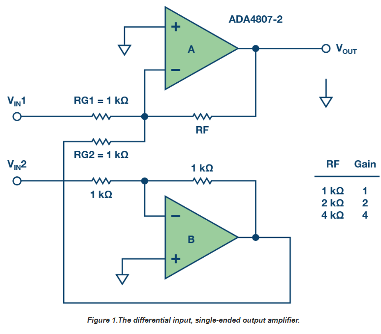
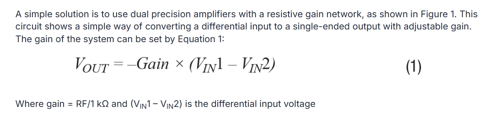

[this]: https://www.allaboutcircuits.com/textbook/semiconductors/chpt-8/the-instrumentation-amplifier/
Alternatively, an instrumentation amplifier circuit can be used in order to achieve [this].

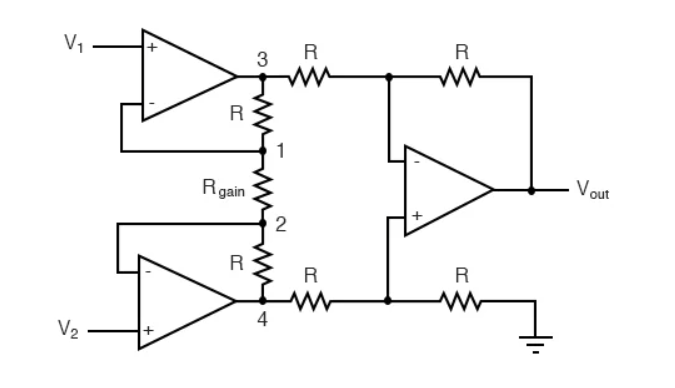
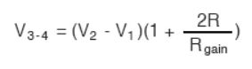

We also looked into op-amps with the purpose of differential amplification:

[AD8276 difference amplifier]: https://www.analog.com/en/products/ad8276.html
Ended up choosing the [AD8276 difference amplifier] because of its unity gain configuration and wide-range input voltage which should help ensure the high voltage from the TENG sensor does not damage the part if the voltage divider is not sufficient. The input voltage range is up to 2(Vs-1.5).

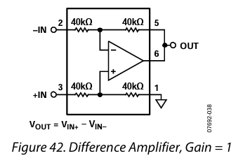

[ADS8681]: https://www.ti.com/product/ADS8681
Since we are interfacing with the [ADS8681], it’s input operating range is single ended and ranges up to 12.288 V, which will be important when stepping down the voltage and choosing the output voltage of the op-amp based on it’s output voltage swing limitation of +VS − 0.2.

# 2025-02-26 - Voltage Divider Design and Circuit Schematic for Interfacing ADS8681 with ESP32-S3-WROOM1
The necessary circuitry for decoupling of the ADS8681 is as follows: 

- Decouple AVDD with AGND using a minimum of 10uF and 1 uF capacitor on each supply. 
- Place 1uF capacitor as close to supply pins as possible. Place a 10uF decoupling capacitor very close to DVDD supply. 
- Digital supply voltage 1uF capacitor with at least 10 V rating recommended, vias between AVDD DVDD pins and bypass capacitors must be AVOIDED
- Refcap-> 2 decoupling capacitors 1uF close to device pins, and 10uF capacitor, directly connected to device pins without visa
- RefIO pin decoupled with a minimum of 4.7 uF capacitor if internal reference is used.

The initial voltage divider is also devised. An estimated differential signal of magnitude 40 V should be stepped down to be within the 12V range of the ADC. Therefore 330k and 100k resistors should be used. 

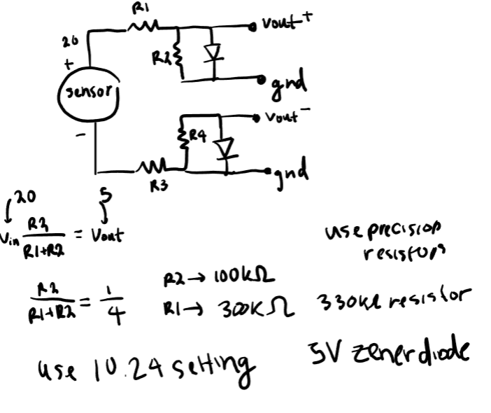

Pin assignments between the ADS8681 and ESP32-S3-WROOM1 should be assigned due to SPI protocol. We will be using the FSPI pins from the ESP32-S3, which interface for fast SPI connection.

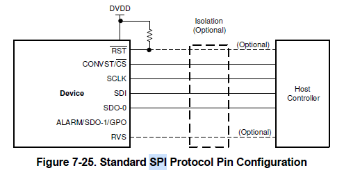
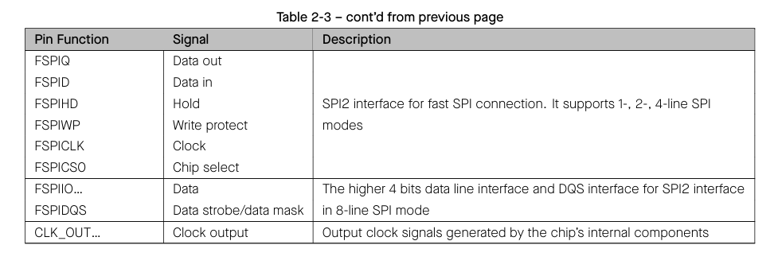
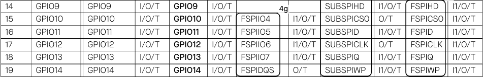

The following interface is determined:
SDO-> GPIO13
SCLK-> GPIO12
CS-> GPIO10
SDI-> GPIO11
RST-> GPIO7 and pulled up to DVDD power with a 10k resistor
RVS-> GPIO8 and pulled down with a resistor of 10k to ground

The following schematics of ADS8681 wired to the ESP32-S3 WROOM 1 were devised
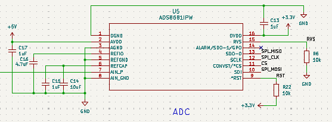
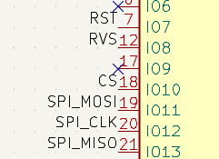
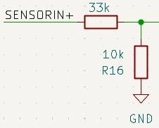

# 2025-02-27 - Finding a Positive to Negative Voltage Converter to Power the Difference Amplifier
Determined a Switched-Capacitor Voltage Converter With Regulators for usage powering the difference amplifier which requires a -Vs of the same magnitude as +Vs in order to function as intended.

The LT1054 was chosen as its output voltage could be controlled by a resistor according to a typical application configuration. For our uses, Vout of 5V was chosen for implementation so according to the equation in the figure below from the datasheet, R2 should be 100k. 
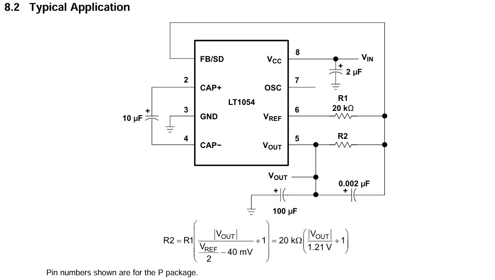

# 2025-04-10 - Determining the Issue with Clipped voltages at Output of Difference Amplifier and Remediate Issue
Tested the difference amplifier and found that with +5 and -5 power, it only outputs up to +5. 
Here are some LTSpice testing results:
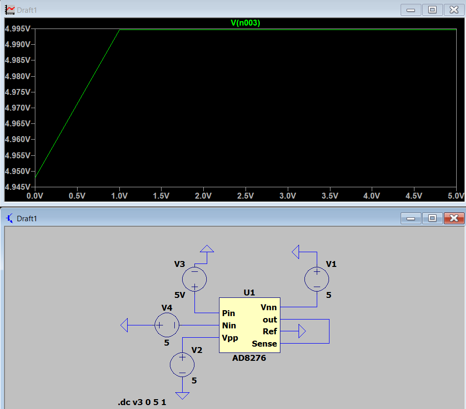
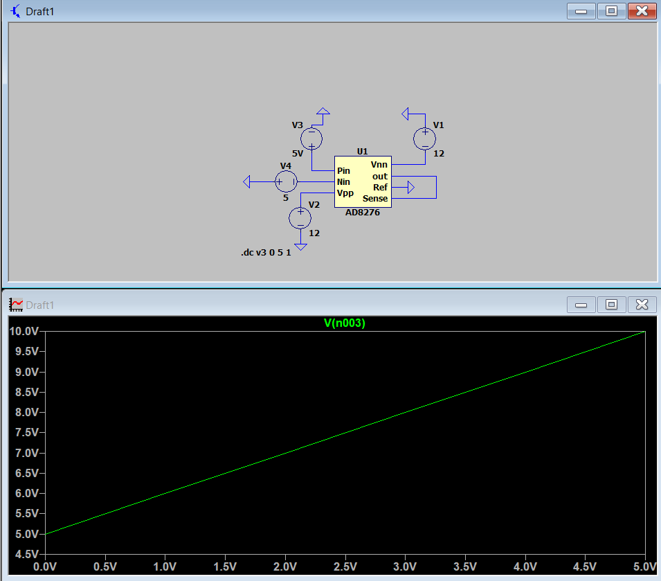

As can be seen, when the +/-V supplies are increased to +/- 12V, the full signal of 10V is outputted, which can be explained by the output voltage swing which is clipped and determined by the positive voltage supply: voltage swing limitation of +VS − 0.2. 

Thus, we needed to change our design for the + voltage to be higher, which can come from a different battery choice, which we initially determined to be 12V, but seen in conjunction with the LDOs chosen, which can only handle up to 10 V, a 9V battery was chosen instead. 

The following schematic was devised for the LT1054 to correspondingly power the negative power rail of the difference amplifier and an R2 value of 169k was chosen: 
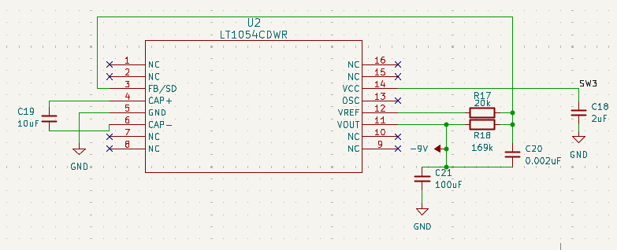

# 2025-04-12 - Determining Issues with the ADC Floating Input Values when Grounded
Modified the ADS8681 according to this design, including a RC filter to minimize distortion and resistors to scale the input signal to detect floating inputs:
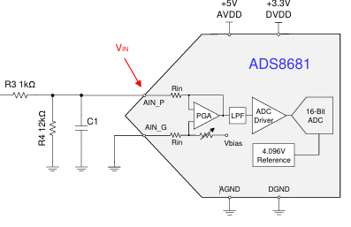
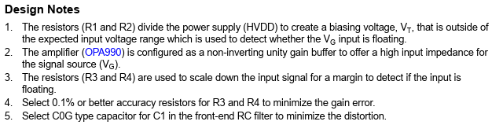

Updated schematic of ADC with inclusion of RC circuit at the input. 
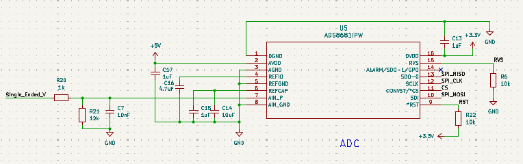

# 2025-04-27 - Adding High Impedance Low Current Buffer Op Amp for TENG Sensor Low Current
After testing and verifications, it was confirmed that the entirety of the PCB worked as intended. However, when interfacing with the TENG sensor, no voltage readings were found. This was confirmed to be because the TENG sensor outputs current in the range of microamps, and thus was being loaded by the PCB circuitry. In order to bypass this, a TL072 op amp, which has an input bias current on the order of picoamps was utilized and voltage readings were then determined.
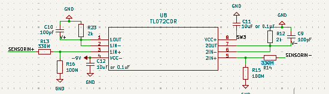

It is also worth noting that the voltage divider is moved to the input of the low current buffer, and the resistance values are increased in order to minimize loading of the sensor. 

