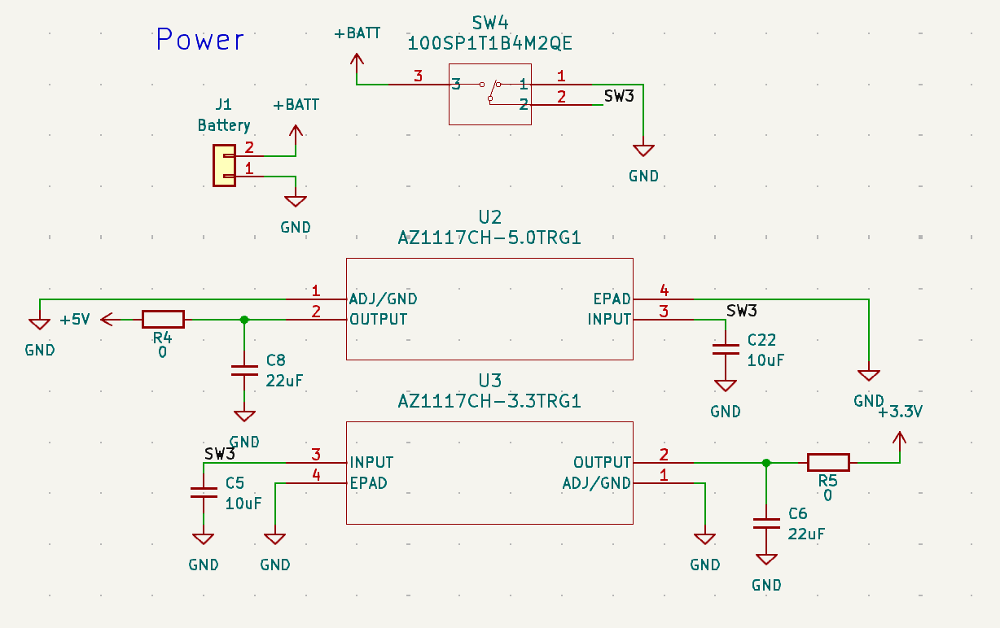
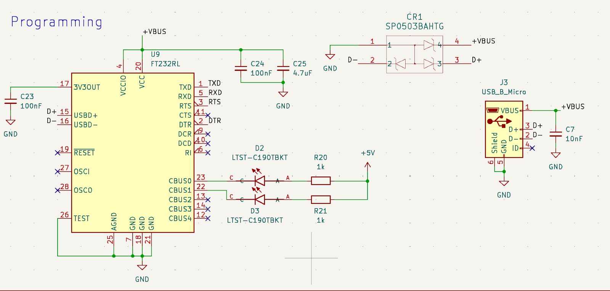
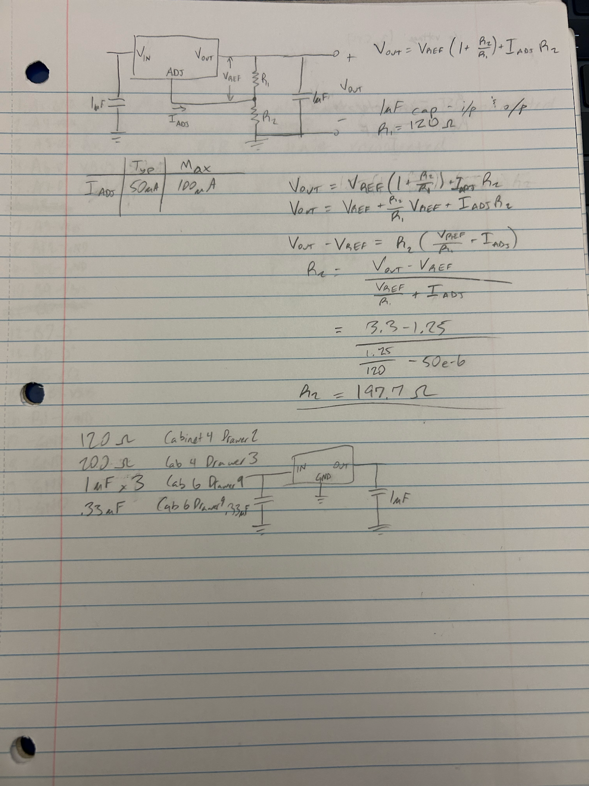
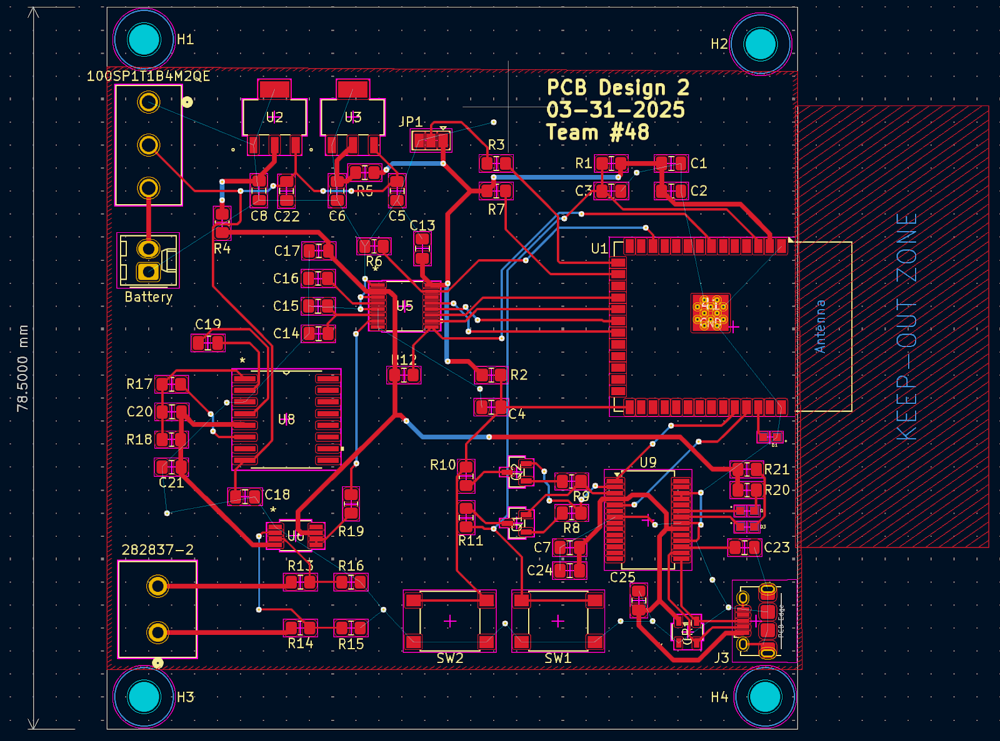
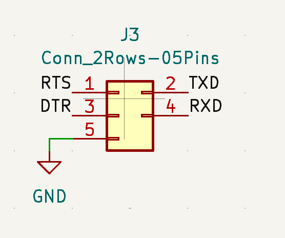
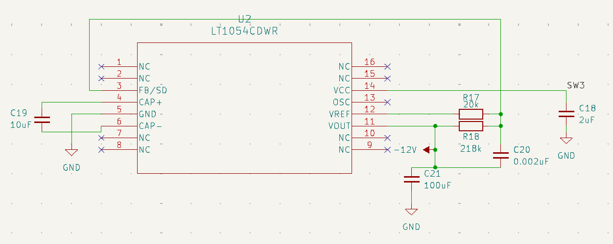
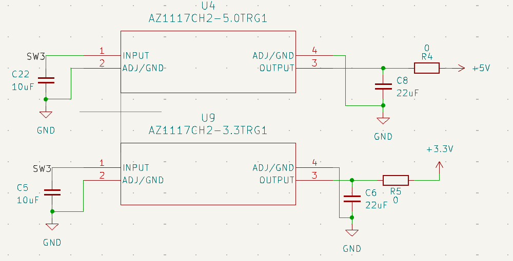
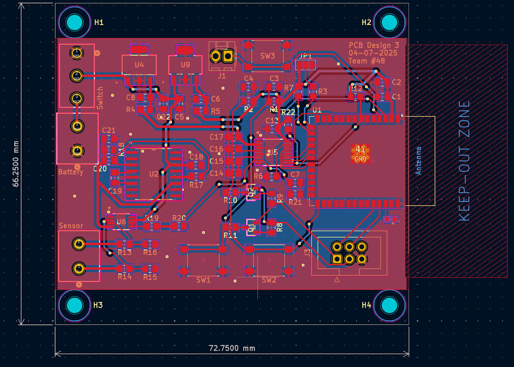

# Lily Worklog

- [Lily Worklog](#lily-worklog)
- [2025-02-15 - TENG Sensor Testing and Circuit Design](#2025-02-15---teng-sensor-testing-and-circuit-design)
- [2025-02-21 - PCB Design](#2025-02-21---pcb-design)
- [2025-03-01 - PCB Order](#2025-03-01---pcb-order)
- [2025-03-03 - Breadboard Demo Preparation](#2025-03-03---breadboard-demo-preparation)
- [2025-03-04/05 - Design Document](#2025-03-0405---design-document)
- [2025-03-11 - PCB Assembly](#2025-03-11---pcb-assembly)
- [2025-03-13 - PCB Updates](#2025-03-13---pcb-updates)
- [2025-03-26 - PCB UART Change](#2025-03-26---pcb-uart-change)
- [2025-04-02 - Progress Report](#2025-04-02---progress-report)
- [2025-04-06 - PCB Power Updates](#2025-04-06---pcb-power-updates)
- [2025-04-22 - PCB Assembly](#2025-04-22---pcb-assembly)
- [2025-04-27 - Final Assembly](#2025-04-27---final-assembly)
- [2025-04-28 - Buffer Addition and Final Integration](#2025-04-28---buffer-addition-and-final-integration)

# 2025-02-15 - TENG Sensor Testing and Circuit Design
- Initial testing with TENG sensor
- Max voltage we saw was about 40V, so we’ll need to voltage divide the reduce signal voltage
- Sensor output is differential, so we’ll need to voltage divide each output

# 2025-02-21 - PCB Design
- Began designing schematic
  - Created power subsystem with 5.0V and 3.3V LDO’s

  - Created programming subsystem with mini USB connector, USB-to-UART, and transient voltage suppressor

# 2025-03-01 - PCB Order
- Created first PCB design and submitted order

# 2025-03-03 - Breadboard Demo Preparation
- Created the power subsystem for breadboard demo using a 5.0V regulator and an adjustable regulator to get 3.3V
- Configured the adjustable regulator to get 3.3V with the setup and equation given in data sheet - shown below in picture
- Included appropriate decoupling capacitors

# 2025-03-04/05 - Design Document
- Worked on design document

# 2025-03-11 - PCB Assembly
- Started assembling first PCB design

# 2025-03-13 - PCB Updates
- Updated PCB with different USB-to-UART that will be easier to solder
- Updated some power traces that should’ve been wider

# 2025-03-26 - PCB UART Change
- Found out we can use an external USB-to-UART to program the microcontroller, so took out the USB connector, USB-to-UART, and diodes and replaced it with a 3x2 programming header to simplify the design

# 2025-04-02 - Progress Report
- Completed individual progress report

# 2025-04-06 - PCB Power Updates
- Tested the -9V voltage converter on the PCB and realized the symbol on the schematic does not align with the footprint, so it does not work
- Updated the symbol to match the layout
- Using the wrong LDO part and fixed the symbols
- Updated PCB

# 2025-04-22 - PCB Assembly
- Began assembling and testing the final PCB design
- LDO’s provide the appropriate voltages as well as the voltage converter
- Able to flash the microcontroller with our code

# 2025-04-27 - Final Assembly
- Preparing for final demo
- Whole board works as expected except when we input sensor signal

# 2025-04-28 - Buffer Addition and Final Integration
- Added a buffer after the sensor and the ADC was able to properly read the voltage output
- Testing final product with enclosure and working mobile app